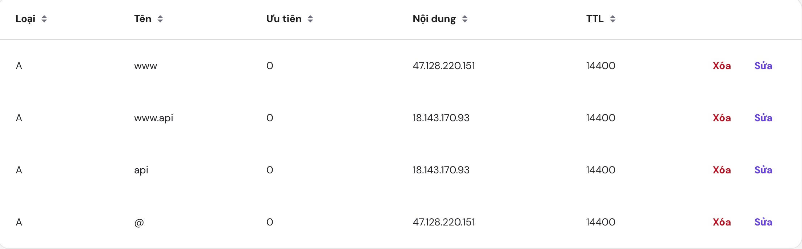

  

This is a comprehensive, production-ready DevOps boilerplate designed for a complete CI/CD lifecycle. It automates infrastructure provisioning with **Terraform**, configuration management with **Ansible**, and deployment with **Jenkins** and **Docker**.

---

## 🚀 Tech Stack

  

- 🌐 **Frontend**: Next.js 15 (Dynamic Port), Tailwind CSS v4, Framer Motion.
- ☕ **Backend**: Spring Boot 3.4.x (Dynamic Port), PostgreSQL (Prod) / H2 (Dev).
- ☁️ **IaC**: Terraform (AWS).
- 🛠️ **Config Management**: Ansible.
- ⚙️ **CI/CD**: Jenkins, Docker, Bash Scripts.

---

## 🛠️ CI/CD Setup Guide (Quick Start)

Follow these steps to set up your automated pipeline from Infrastructure provisioning to deployment.

### 1.  Jenkins Configuration (Required)

Configure the following two sections in your Jenkins UI:

#### A. Global Credentials

Navigate to `Manage Jenkins` -> `Credentials` -> `System` -> `Global credentials`:

| Credential ID     | Type                          | Description                                         |
| :---------------- | :---------------------------- | :-------------------------------------------------- |
| `aws-access-key`  | Secret text                   | Your AWS IAM Access Key ID                          |
| `aws-secret-key`  | Secret text                   | Your AWS IAM Secret Access Key                      |
| `dockerhub-creds` | Username/Password             | Docker Hub credentials for image registry           |
| `rds-db-password` | Secret text                   | Password for the AWS RDS instance                   |
| `ec2-ssh-key`     | SSH Username with private key | **User**: `ec2-user`, **Key**: Paste `.pem` content |

#### B. Global Environment Variables

Navigate to `Manage Jenkins` -> `System` -> **Global properties**:

- Enable **Environment variables**.
- Add a new variable:
  - **Name**: `PATH+EXTRA`
  - **Value**:
    - Apple Silicon Mac: `/opt/homebrew/bin`
    - Linux / Intel Mac: `/usr/local/bin`

---

### 2.  AWS Key Pair Matching

Ensure the SSH key name in AWS matches the project configuration:

1. In AWS Console -> EC2 -> **Key Pairs**.
2. Create a key pair named **`AWS_key_pair`** (format `.pem`).
3. Download the file, open with a text editor, and copy the entire content.
4. Add it to the Jenkins `ec2-ssh-key` credential under the "Private Key" section.

---

### 3.  Configuration Files (Properties & .env)

This project uses **Configuration as Code**. Avoid manual parameter entry in the Jenkins UI.

- **Master Switch (`application.properties`)**: Located at the root.
  - Set `ENV_TARGET=dev` or `ENV_TARGET=prod` to select the environment.
- **Technical Settings (`infrastructure/envs/[dev|prod]/pipeline.properties`)**:
  - Update `DOCKER_USER` to your Docker Hub username.
  - Modify ports (`BACKEND_PORT`, `FRONTEND_PORT`) if needed.
  - Ensure `AWS_SSH_KEY_NAME=AWS_key_pair`.

> [!NOTE]
> Frontend `.env` files are automatically updated with the backend URL (`NEXT_PUBLIC_API_URL`) during the Jenkins build process. No manual editing is required for the pipeline.

---

### 4.  Local Development (Optional)

To run the project locally without Jenkins:

- **Backend**: `cd backend && ./mvnw spring-boot:run`
- **Frontend**:
  1. `cd frontend && npm install`
  2. Create `.env.local` with `NEXT_PUBLIC_API_URL=http://localhost:7070`
  3. `npm run dev`

---

### 5.  Execution & Monitoring

1. **Deploy**: Simply `git commit` and `git push` your code to the linked repository.
2. **Monitor**: Open your Jenkins Job and watch the **Console Output**.
3. **Audit**: Upon success, Jenkins will print the Frontend and Backend URLs at the end of the log.

---

### 6.  Automation with Webhooks

We **highly recommend using GitLab** for a more robust Jenkins integration.

#### A. For GitHub

- **Jenkins**: In Job config, check **GitHub hook trigger for GITScm polling**.
- **GitHub**: `Settings` -> `Webhooks` -> `Add webhook`.
  - **Payload URL**: `http://<jenkins-url>/github-webhook/`
  - **Content type**: `application/json`

#### B. For GitLab (Recommended) 🎖️

- **Jenkins**: Install the `GitLab Plugin`. Check **Build when a change is pushed to GitLab**.
- **GitLab**: `Settings` -> `Webhooks` -> `Add new webhook`.
  - **URL**: Paste the link generated in the Jenkins trigger section.
  - **Trigger**: `Push events`.

> [!IMPORTANT]  
> If Jenkins is running on your local machine, you **MUST** use **ngrok** to create a public tunnel:  
> `ngrok http 8080`  
> Use the generated `https://...` link as your Webhook Payload URL.

---

### 7. 🌐 Production DNS & HTTPS Configuration

> [!IMPORTANT]  
> If you set `ENV_TARGET=prod` in `application.properties`, you **MUST** configure a domain name (DNS) to enable HTTPS/SSL.

When deploying to production, ensure your Domain Provider (e.g., Cloudflare, Namecheap, GoDaddy) is configured with the following records pointing to your dynamic EC2 IPs:

- **Backend (API)**: Set `api` and `www.api` A-records pointing to the **Backend Instance IP**.
- **Frontend (Web)**: Set `@` (root) and `www` A-records pointing to the **Frontend Instance IP**.

Refer to the example configuration below:

---

---

  
  
<b>Crafted with ❤️ by Bingsu (Gia An)</b>

